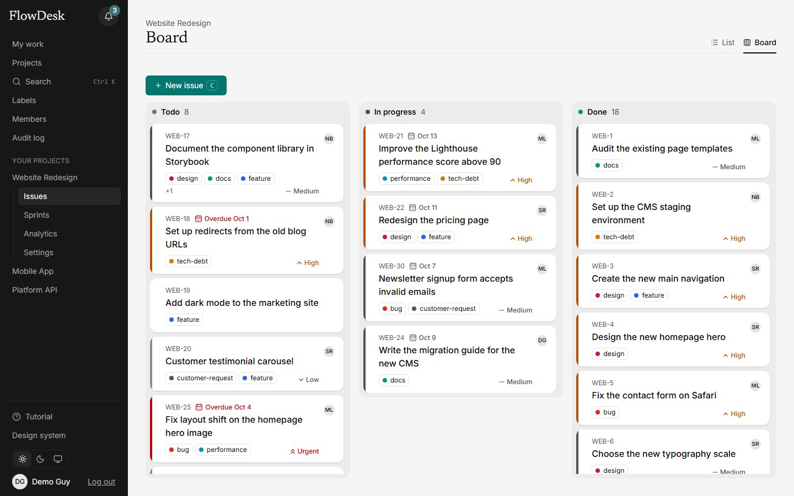
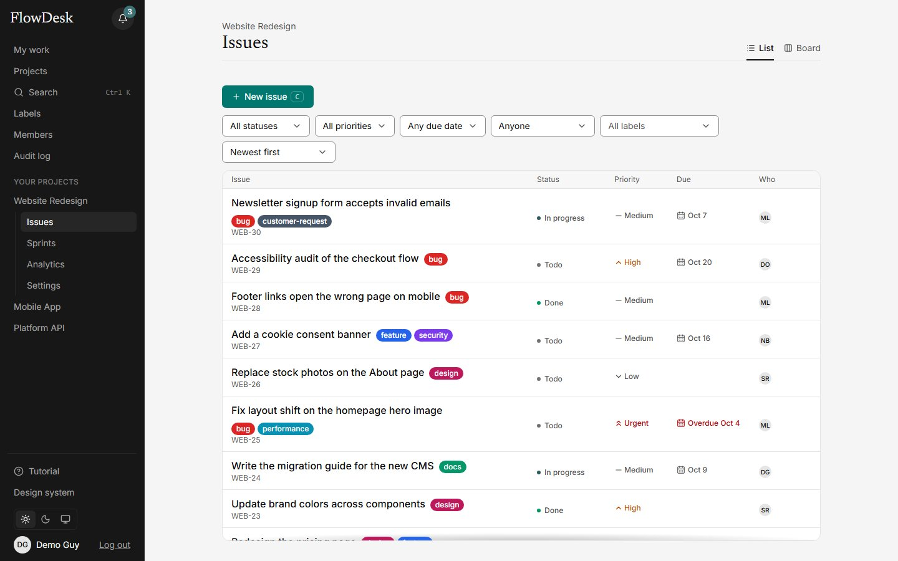
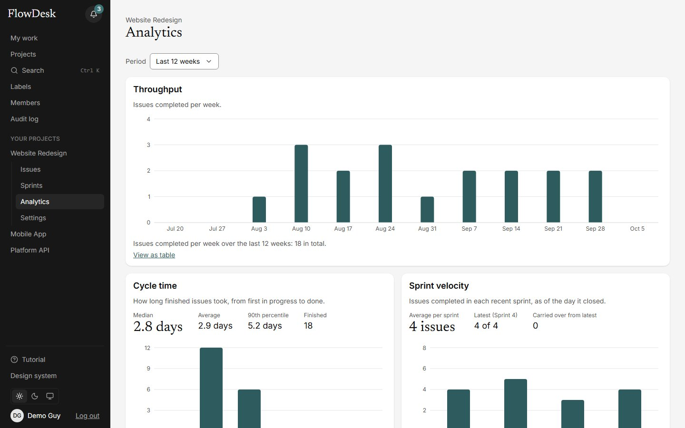

# FlowDesk

A collaborative project-management app for small engineering teams: organizations, projects, issues, a board, sprints, comments, notifications and analytics. It is built as a real product, not a demo of one, and as a learning project: every architectural decision is written down as a short record (see [Decisions](#decisions)).

**Live: <https://flowdesk-yotg.onrender.com>** (click "Try the demo" for a private copy with sample data, deleted after about two hours).



The live site runs on free hosting, so a few things are different from a paid product (see [What to know](#what-to-know-about-the-live-site)).

## What it does

- **Work:** projects with readable keys (`/projects/WEB/issues/WEB-12`), issues with status, priority, assignee, labels and due dates; a drag-and-drop board and a sprint planner (planned, active, completed) with a sortable backlog.
- **Together:** comments with files and `@mentions`, live updates and presence over WebSockets, notifications, invitations by email link, roles (owner, admin, member), profiles with photos, and an organization audit log.
- **Insight:** analytics computed from the issue history: throughput, cycle time, sprint velocity and breakdowns, with ranges kept in the address.
- **Finding things:** full-text search (a Postgres index, not a search service) and a command palette on Ctrl+K.
- **Accounts:** email and password, Google and GitHub sign-in, renewed sessions with inactivity sign-out, and a guided tour for new people.

| Issues | Analytics |
|---|---|
|  |  |

## How it is built

```
React SPA (Vite)
   │  REST /api/v1         WebSocket (Socket.IO)
   ▼                       ▼
Express API ── services ── Drizzle ── PostgreSQL
   │
   └── files in an S3-compatible bucket (disk in development)
```

- **Web:** React 19, TypeScript, Vite, TanStack Query, React Hook Form, Zod, React Router, Tailwind v4, Recharts. Feature-Sliced Design layers (`app, pages, widgets, features, entities, shared`), enforced by a lint rule that fails the build on a wrong import. A two-tier design-token system (primitives, then semantic tokens) with light and dark themes.
- **API:** Node, Express, TypeScript, layered modules (routes, controller, service, repository), Zod validation, JWT access tokens with rotating refresh tokens, Argon2id password hashing, pino logging with credentials redacted, rate limits, Socket.IO.
- **Database:** PostgreSQL with Drizzle. Every query that reads tenant data takes the organization id. State-changing issue operations write an append-only event row in the same transaction; the activity feed, notifications and analytics all read it.
- **Shared contracts:** `packages/contracts` holds the Zod schema of every request and response. The API validates with it and the web app infers its types from it, so the two cannot drift apart unnoticed.
- **Production:** one Node process serves the built web app, the API and the WebSocket on one address, runs the database migrations at start, and shuts down cleanly. Hosting is Render (the server) with Neon (Postgres and file storage), both on free plans.

## Run it locally

You need Node 24 or newer, pnpm (the exact version is in `package.json`) and a local PostgreSQL 16.

```bash
pnpm install

# One-time: a least-privilege role and two databases (pick your own password).
#   CREATE ROLE flowdesk WITH LOGIN PASSWORD '<password>';
#   CREATE DATABASE flowdesk_dev  OWNER flowdesk;
#   CREATE DATABASE flowdesk_test OWNER flowdesk;

cp apps/api/.env.example apps/api/.env   # then fill in the secrets; the file explains each one
pnpm db:migrate
pnpm db:seed:demo                         # a demo organization: log in as demo@flowdesk.test, password Demo123!@#
pnpm dev                                  # web on :5173, API on :4000
```

The API refuses to start without a `RESEND_API_KEY` value, but any placeholder works for local development: emails then fail and are logged, and the verification and reset links are not delivered. Google and GitHub sign-in buttons appear only when their credentials are in `.env`.

## Tests

| Command | What it runs |
|---|---|
| `pnpm typecheck` / `pnpm lint` | The whole workspace. Lint also enforces the layer rules. |
| `pnpm test` | The API tests against a real Postgres (about 530 tests as of 2026-10-09). |
| `pnpm test:e2e` | The browser tests (Playwright, about 270 tests) on their own servers and database. One-time: `pnpm exec playwright install chromium`. |
| `pnpm test:e2e:prod` | Builds the app and runs the built version as one process, the way production runs it. |

The same checks run on GitHub for every push and pull request (see `.github/workflows/ci.yml`), the browser suite split into four parallel shards. Tests are written with a stated reason and are checked by breaking the code on purpose: a test that still passes after the break is fixed or removed.

## Deployment

The live site is one Render web service (`render.yaml` records its settings) with a Neon database and a Neon object-storage bucket for files. Secrets live only in Render's environment. Two scheduled GitHub workflows watch it: a daily read-only smoke check (`uptime.yml`) and a weekly encrypted database backup (`backup.yml`, see `docs/backups.md`). Unexpected server errors can be sent to Sentry when `SENTRY_DSN` is set.

## What to know about the live site

- **It sleeps.** The free server stops after about 15 quiet minutes and takes up to a minute to wake. This is a deliberate choice (no keep-alive pings).
- **No email to other people yet.** Sending needs a domain I do not have, so invitation and reset emails are not delivered.
- **Google sign-in is in testing mode:** only listed test users can use it. GitHub sign-in is not limited that way, but I have only tried it with my own account.
- **File storage and error tracking depend on free-tier services** whose limits I have not confirmed (see `docs/roadmap.md` for what was and was not checked).
- **Security notes** (what was reviewed, what is accepted, how to rotate each secret) are in `docs/security.md`.

## Decisions

Each decision is a short record in [`docs/adr/`](docs/adr). The ones I would start with:

| Record | Decision |
|---|---|
| [0001](docs/adr/0001-postgresql-and-drizzle.md) | PostgreSQL with Drizzle: the domain is relational, and the ORM stays close to SQL. |
| [0002](docs/adr/0002-shared-zod-contracts.md) | One Zod schema per request and response, shared by API and web. |
| [0003](docs/adr/0003-auth-strategy.md), [0048](docs/adr/0048-refresh-token-grace-window.md) | Rotating refresh tokens with reuse detection, and the 10-second grace window found by the first CI run. |
| [0004](docs/adr/0004-tenant-isolation.md) | Tenant isolation in both the middleware and every query. |
| [0005](docs/adr/0005-event-sourced-audit.md), [0009](docs/adr/0009-analytics-from-events.md) | An append-only event log written in the same transaction; analytics computed from it. |
| [0007](docs/adr/0007-fractional-board-ranking.md) | Board order as fractional ranks in Postgres `numeric`, never integer positions. |
| [0020](docs/adr/0020-e2e-tests-with-playwright.md), [0047](docs/adr/0047-continuous-integration.md) | Browser tests as code in the repository; CI in four parallel shards. |
| [0042](docs/adr/0042-oauth-sign-in.md) | Google and GitHub sign-in with PKCE and a signed state cookie, no stored attempts. |
| [0044](docs/adr/0044-try-the-demo.md) | A private, self-deleting demo copy per visitor, with server-side limits. |
| [0045](docs/adr/0045-hosting-on-render-free.md), [0046](docs/adr/0046-production-server.md) | Free hosting, and one process serving everything. |
| [0050](docs/adr/0050-secrets-out-of-logs.md), [0054](docs/adr/0054-security-pass.md) | Credentials kept out of logs; the first security pass. |
| [0053](docs/adr/0053-object-storage.md) | Files in an S3-compatible bucket behind one small interface, tested against a fake S3. |

More: [`docs/architecture.md`](docs/architecture.md), [`docs/roadmap.md`](docs/roadmap.md) (what is done and what was checked), [`docs/learning-log.md`](docs/learning-log.md).

## Licence

All rights reserved: the code is public so it can be read, not so it can be copied or reused (see [`LICENSE`](LICENSE)). To ask for permission, use the contact details on the live site's landing page.
